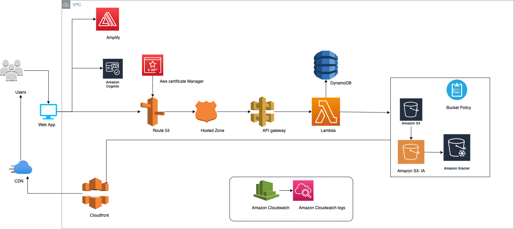

### University Name: http://www.sjsu.edu/

### Course: [Cloud Services]

### Demonstration of the Website: [YouTube Link](https://youtu.be/uIFMUfG9acE)

### Team Members
   ###### [ANANTH UPADHYA](https://www.linkedin.com/in/560085/)
   ###### [DEESHA DESAI](https://www.linkedin.com/in/deeshadesai/)
   ###### [PREETI PARIHAR](https://www.linkedin.com/in/preetiparihar/)
   ###### [PRIYANKA DEVENDRAN](https://www.linkedin.com/in/priyanka-devendran-76244479/)
   
### Project Introduction
    Hire my services is a home service company, an online platform to find and hire personal and local housekeeping services. It is new marketplace which creates additional employment where the skilled providers can post their skills and availability for self-employment. On the other hand, it helps consumers to easily locate the right professional for a required job.
    Home service company allows the consumers to search for the required services and book the services with ease without going through the frustration of finding the required professional to provide the services at the doorstep. 
    Online business has become more convenient amidst current pandemic situation. Services such as beauty service, childcare services can be delivered at home therefore avoiding the unnecessary hassle to travel outside, making life simple and safe.  
    Our Hire My services application covers all the things mentioned above. It is a website through which the service providers can register and post the services and the consumer can login, update their profiles and request services from service providers.

   ###### Feature List:
  
        1. PROVIDER
        * Register for services
        * Accept requested appointments
        * Cancel the requested appointments
        * Update the Profile

        2. CONSUMER
        * Request for services
        * Cancel scheduled services
        * Rate the provider services
        * Update the profile


## Architect Diagram:



## UML Diagram


### Pre-requisites Set Up:

###### Frontend:

Pre-requisites: 
```
Node.js -Version 12 https://nodejs.org/en/

Frontend Technologies: NPM,HTML, SCSS, Angular CLI, Angular 10, Angular-material, Bootstrap, JEST.

To run Angular application in local:

Run following commands in ‘/UI/hire-my-services/’ 

1)npm install -g @angular/cli
2)npm install
2)ng serve

Server will be running on ‘http://localhost:4200’ 
```

###### Backend APIs

* Requirements:

    set following environment variables values:

    ```
    AWS_ACCESS_KEY_ID = os.getenv("AWS_ACCESS_KEY_ID", None)
    AWS_SECRET_ACCESS_KEY = os.getenv("AWS_SECRET_ACCESS_KEY", None)
    AWS_REGION = os.getenv("AWS_REGION", None)
    COGNITO_USER_POOL_ID = os.getenv("COGNITO_USER_POOL_ID", None)
    COGNITO_APP_CLIENT_ID = os.getenv("COGNITO_APP_CLIENT_ID", None)
    S3_BUCKET = os.getenv("S3_BUCKET", None)
    S3_URL = os.getenv("S3_BUCKET", None)
    CLOUD_FRONT_URL = os.getenv("CLOUD_FRONT_URL", None)
    ```

    ```pip3 install -r requirements.txt```

    ```python3 flask_app.py```


### Website Screenshots

#### Login


#### Customer Register


#### Provider Register


#### Customer Home Page(List of services)


#### Service Providers Page


#### Book Appointment


#### Customer Appointments


#### Review Provider


#### Provider Reviews


#### Customer Edit Profile


#### Provider Appointments


#### Provider Profile


